# Third Eye - AI Assistant App for Blind People | Google Gemini API Developer Competition Submission #buildwithgemini

[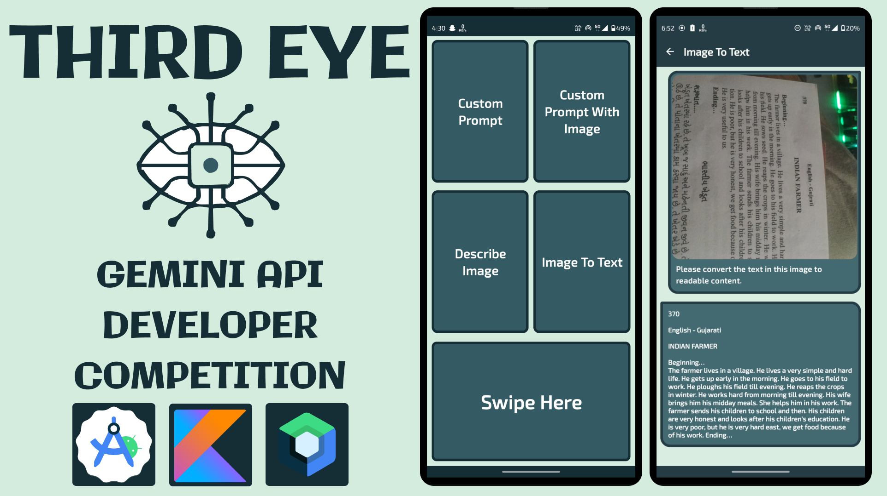](https://youtu.be/cRTjUSgXhKY?si=1D-FlGa3eUcPhOYR)

Click the image above to watch a demo of the Third Eye App on YouTube.

**Third Eye** is an innovative Android application designed to assist blind people by leveraging the power of Gemini AI. The app provides advanced functionalities to enhance accessibility and support daily tasks through voice commands and Gemini AI-powered features.

## Features:

### 1. Custom Prompt:

- **Purpose:** Allows you to enter a custom query or instruction.
- **How to Use:**
    1. Open the app and navigate to the custom prompt section.
    2. Speak or type your custom instruction or query.
    3. The AI Assistant will process your input and provide a response based on the query.

### 2. Custom Prompt with Image:

- **Purpose:** Combine a custom prompt with an image for more context-specific responses.
- **How to Use:**
    1. Open the app and go to the custom prompt and image upload section.
    2. Speak or type your custom instruction and upload an image.
    3. The AI Assistant will analyze the image in conjunction with your prompt to provide a relevant response.

### 3. Describe Image:

- **Purpose:** Provides you a textual description of an uploaded or captured image.
- **How to Use:**
    1. Open the app and navigate to the image description feature.
    2. Upload or capture an image using the app's camera.
    3. The AI Assistant will generate a descriptive text summarizing the content of the image.

### 4. Image to Text:

- **Purpose:** Extracts and displays text from an image.
- **How to Use:**
    1. Open the app and go to the image-to-text conversion section.
    2. Upload or capture an image that contains text.
    3. The AI Assistant will process the image and provide the extracted text for you to view.

# Technologies:

- Kotlin
- Jetpack Compose for UI development
- Navigation
- Camera
- Koin for Dependency Injection
- Generative AI for All AI-related stuff

# Libraries:

- [Gemini API](https://ai.google.dev/api?lang=android) - API client for interacting with the Google Gemini AI.
- [Splash API](https://developer.android.com/develop/ui/views/launch/splash-screen) - API for adding a splash screen to your app.
- [Lifecycle and ViewModel](https://developer.android.com/jetpack/androidx/releases/lifecycle) - Provides lifecycle-aware ViewModel support for Jetpack Compose.
- [Navigation](https://developer.android.com/develop/ui/compose/navigation) - Jetpack Navigation library for handling in-app navigation in Jetpack Compose.
- [Koin](https://insert-koin.io/) - Kotlin dependency injection library with multiplatform support.
- [CameraX](https://developer.android.com/jetpack/androidx/releases/camera) - A set of libraries for integrating and managing camera functionalities in Android apps.
- [Markdown](https://github.com/jeziellago/compose-markdown) - Library for rendering Markdown content in Jetpack Compose.

# Installation:

1. Clone the repository:
   ```bash
   git clone https://github.com/Coding-Meet/Third-Eye.git
2. Open in the latest version of Android Studio or intellij idea.
3. Before running the project, obtain an API key from [Google AI](https://ai.google.dev) to communicate with the Gemini
   API.
4. Add a `local.properties` file to the project root.
5. Place your Gemini API key in `local.properties` file as `Gemini_API_KEY` property.
```properties
Gemini_API_KEY="YOUR_API_KEY"
```
6. Sync the project with Gradle files in Android Studio or IntelliJ IDEA to ensure all dependencies are downloaded.
7. Build the project by selecting `Build` > `Rebuild Project` from the menu. 
8. Run the app on an emulator or physical device by selecting `Run` > `Run 'app'` from the menu.

# Screenshot:

<table>
   <tr>
    <td>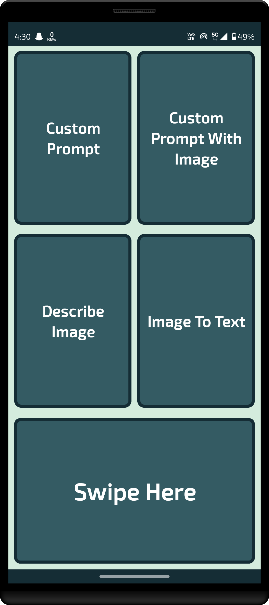</td>
    <td>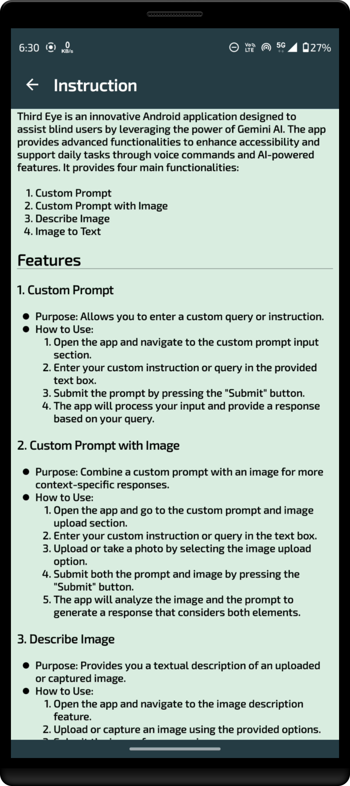</td>
   </tr>
   <tr>
    <td>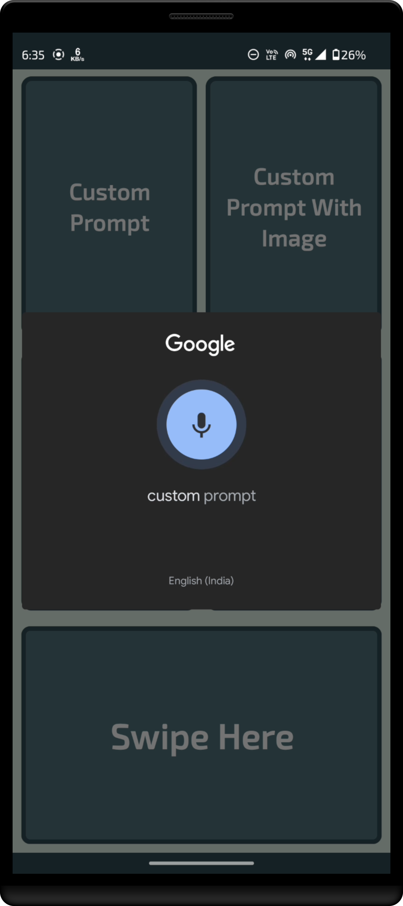</td>
    <td>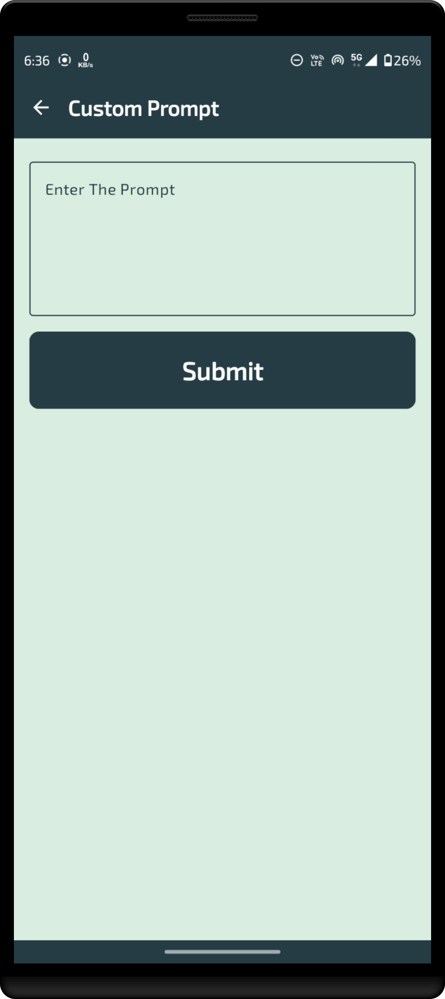</td>
   </tr>
   <tr>
    <td>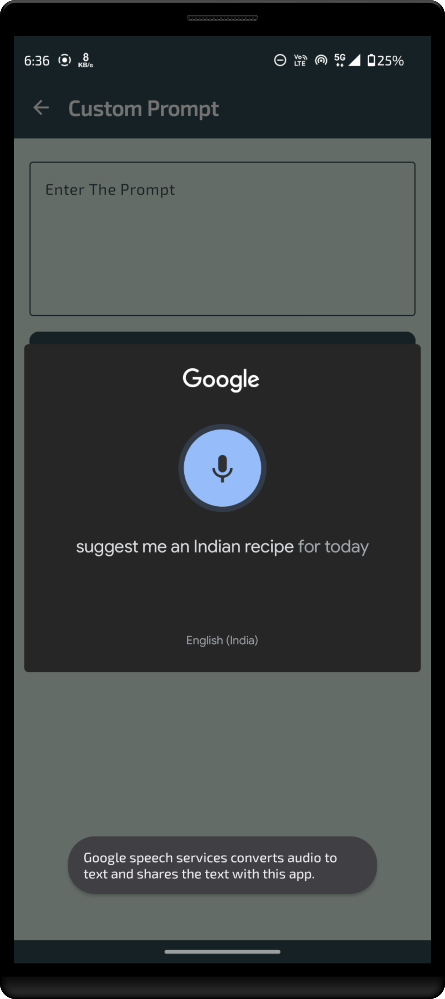</td>
    <td></td>
   </tr>
   <tr>
    <td>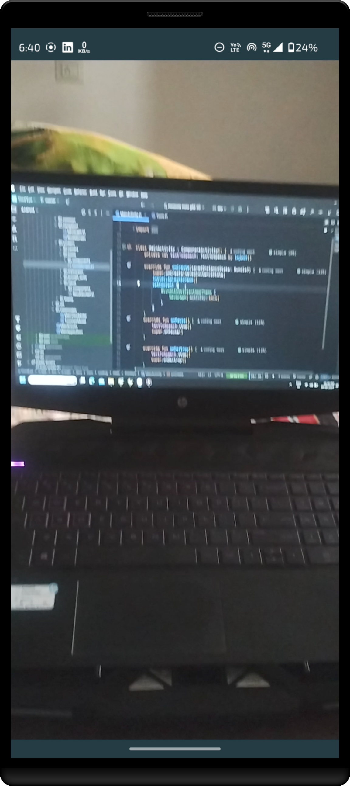</td>
    <td>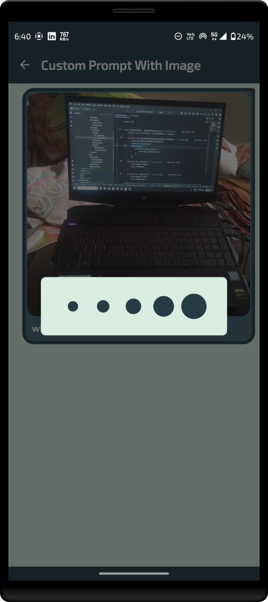</td>
   </tr>
   <tr>
    <td></td>
    <td>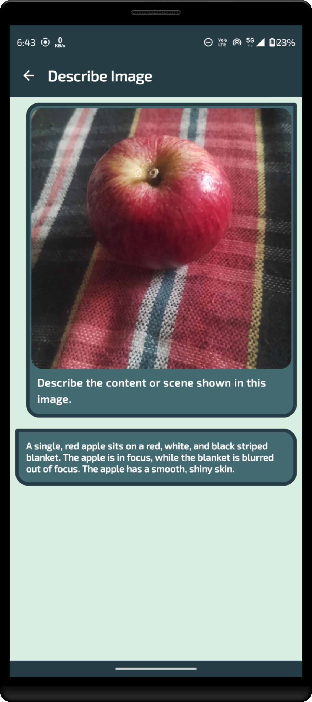</td>
   </tr>
   <tr>
    <td>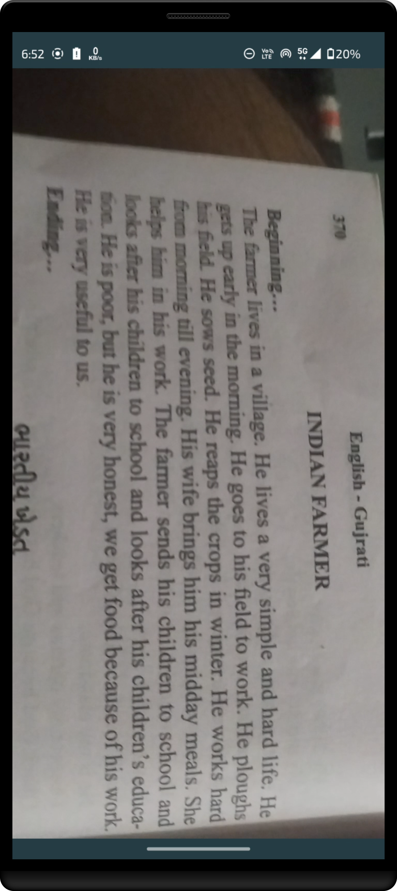</td>
    <td>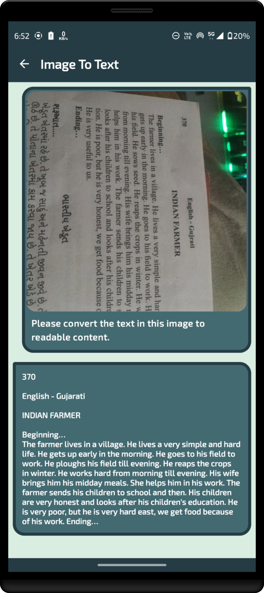</td>
   </tr>
</table>

Your generosity is greatly appreciated! Thank you for supporting this project.

# Connect with me

[](https://youtube.com/@CodingMeet26?si=FuKwU-aBaf_5kukR)
[](https://www.linkedin.com/in/coding-meet-a74933273/)
[](https://twitter.com/CodingMeet)

# Author

**Meet**
