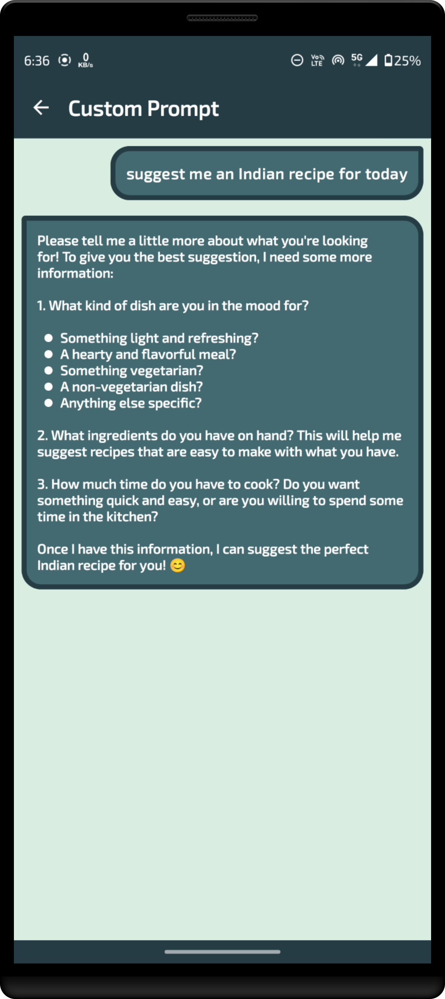
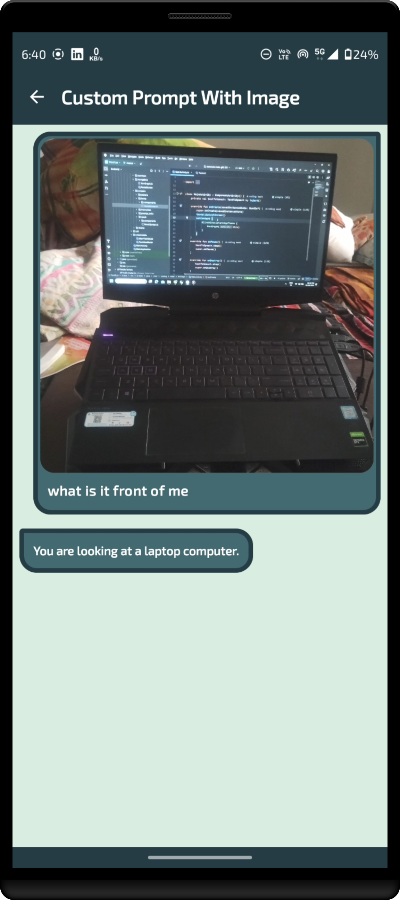

# Third Eye

[](https://youtu.be/YhWhR6IVs_Y)

Click the image above to watch a demo of the Third Eye App on YouTube.

**Third Eye** is an innovative Android application designed to assist blind users by leveraging a Blind AI Assistant. The app provides advanced functionalities to enhance accessibility and support daily tasks through voice commands and AI-powered features.

## Features

### 1. Custom Prompt

- **Purpose:** Allows users to enter custom queries or instructions via voice commands.
- **How to Use:**
    1. Open the app and navigate to the custom prompt section.
    2. Speak or type your custom instruction or query.
    3. The AI Assistant will process your input and provide a response based on the query.

### 2. Custom Prompt with Image

- **Purpose:** Combine custom prompts with image analysis to provide context-specific responses.
- **How to Use:**
    1. Open the app and go to the custom prompt and image upload section.
    2. Speak or type your custom instruction and upload an image.
    3. The AI Assistant will analyze the image in conjunction with your prompt to provide a relevant response.

### 3. Describe Image

- **Purpose:** Provides a textual description of an uploaded or captured image.
- **How to Use:**
    1. Open the app and navigate to the image description feature.
    2. Upload or capture an image using the app's camera.
    3. The AI Assistant will generate a descriptive text summarizing the content of the image.

### 4. Image to Text

- **Purpose:** Extracts and converts text from an image into editable and searchable text.
- **How to Use:**
    1. Open the app and go to the image-to-text conversion section.
    2. Upload or capture an image that contains text.
    3. The AI Assistant will process the image and provide the extracted text for you to view, copy, or save.

## Installation🛠️

1. Clone the repository:
   ```bash
   git clone https://github.com/Coding-Meet/Third-Eye.git
2. Open in the latest version of Android Studio or intellij idea.
3. Before running the project, obtain an API key from [Google AI](https://ai.google.dev) to communicate with the Gemini
   API.
4. Add a `local.properties` file to the project root.
5. Place your News API key in `local.properties` file as `Gemini_API_KEY` property.

```properties
Gemini_API_KEY=YOUR_API_KEY
```

## Screenshot 💻

<table>
   <tr>
    <td></td>
    <td></td>
   </tr>
   <tr>
    <td></td>
    <td></td>
   </tr>
   <tr>
    <td></td>
    <td></td>
   </tr>
   <tr>
    <td></td>
    <td></td>
   </tr>
   <tr>
    <td></td>
    <td></td>
   </tr>
   <tr>
    <td></td>
    <td></td>
   </tr>
</table>

Your generosity is greatly appreciated! Thank you for supporting this project.

## Connect with me

[](https://youtube.com/@CodingMeet26?si=FuKwU-aBaf_5kukR)
[](https://www.linkedin.com/in/coding-meet-a74933273/)
[](https://twitter.com/CodingMeet)

## Author

**Meet**
